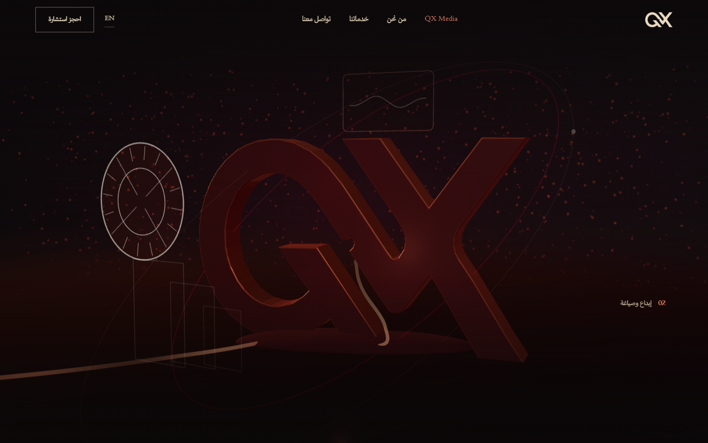
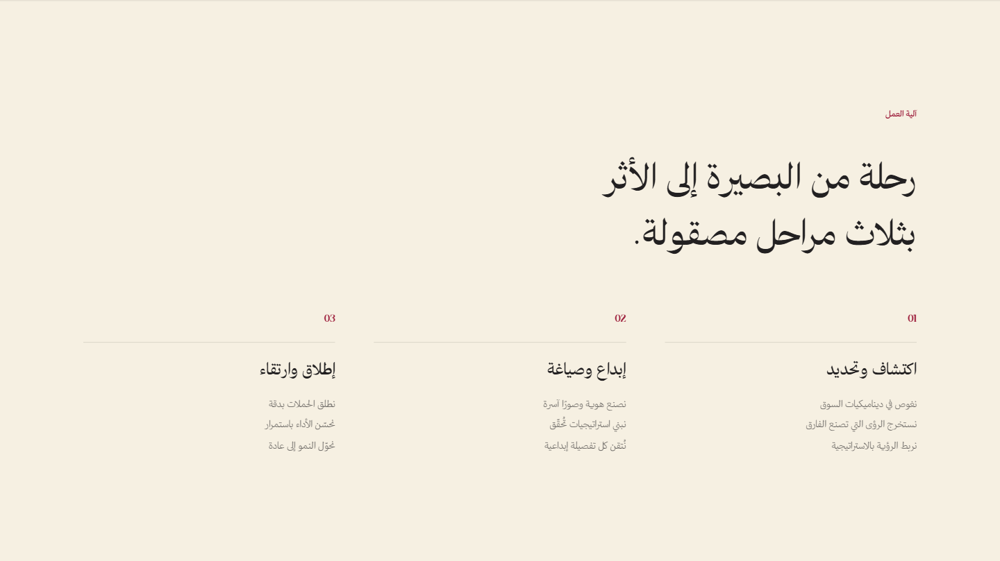

<div align="center">


# QX Media

**قالب ووردبريس عربي أولًا وثنائي اللغة، بواجهة رئيسية ثلاثية الأبعاد تتحرك مع التمرير.**<br>
صممه وبناه [طارق عكاشة](https://github.com/tarekokashha) لصالح QX Media، بيت خبرة تسويقي في الرياض.

[](https://github.com/tarekokashha/qx-media-brand/actions/workflows/ci.yml)
[](LICENSE)
[](NOTICE.md)


[**الموقع الحي**](https://qxmedia.sa) · [English](README.md) · [التوثيق](docs/) · [التثبيت](docs/install.md) · [معرض أعمالي](https://tarek-portfolio-phi.vercel.app)

</div>

---



<sub>الموقع الحي [qxmedia.sa](https://qxmedia.sa)، التُقطت اللقطة في 2 أكتوبر 2026. يتحول الشعار مع تمرير الزائر.</sub>

## عن المشروع

QX Media بيت خبرة تسويقي في الرياض. بنيتُ حضوره الرقمي: **الموقع ثنائي اللغة (عربي وإنجليزي) على قالب ووردبريس مخصص**، و**هويته وأنظمته البصرية**، و**نبرة الصوت** التي تمتد عبر كل ما يُنشر. وهي شراكة مستمرة، لا مجرد تسليم.

كان المطلوب موقعًا يشبه ما تبيعه العلامة: هادئ وتحريري، لا قالبًا جاهزًا لوكالة. وأن يكون عربيًا أولًا ومعه الإنجليزية، سريعًا، ولا يعتمد على أداة بناء صفحات في الصفحات التي يغطيها التصميم.

هذا المستودع هو القالب وأدواته، وشرح لطريقة عمله.

## نظرة سريعة

| | |
|---|---|
| **الدور** | الهوية البصرية وتنفيذ التصميم وهندسة الواجهة والقالب والأدوات: [طارق عكاشة](https://github.com/tarekokashha) |
| **العميل** | QX Media، الرياض، المملكة العربية السعودية |
| **الموقع الحي** | [qxmedia.sa](https://qxmedia.sa) (القالب 2.2.1). هذا المستودع 2.3.0 |
| **اللغات** | العربية افتراضيًا (من اليمين إلى اليسار) والإنجليزية تحت `/en/` عبر Polylang |
| **التقنيات** | ووردبريس 6.6+ وPHP 8.0+ وجافاسكربت بلا أطر وThree.js r169 (مُقلَّم من الشيفرة غير المستخدمة) |
| **الواجهة الرئيسية** | WebGL بخمس مراحل، حجمها 141 كيلوبايت مضغوطة، وتُحمَّل في الصفحة الرئيسية فقط وبعد حدث `load` |
| **القياس** | Lighthouse على الجوال: إمكانية الوصول **100** وSEO **100** وأفضل الممارسات 96. LCP بزمن 1.57 ثانية وCLS صفر. التفاصيل في [الأداء](docs/performance.md) |

## ما الذي يحتويه

### واجهة ثلاثية الأبعاد اختيارية بالتصميم
مشهد WebGL مثبّت يتحرك مع التمرير ويحوّل الشعار عبر خمس مراحل. كل ما يحتاجه الزائر من كلمات هو HTML دلالي فوق اللوحة، فإن غاب WebGL أو جافاسكربت، أو فضّل الزائر تقليل الحركة، تصير الواجهة شاشة واحدة مقروءة. والعنوان الرئيسي هو أكبر عنصر يُرسم، لا صورة. ومحرك العرض مُجمَّع من Three.js بعد حذف غير المستخدم، بحجم **141 كيلوبايت مضغوطة بدل 167**، ولا يصل إلى من يقرأ مقالًا. ← [الواجهة ثلاثية الأبعاد](docs/3d-hero.md)

### عربية مُهندَسة لا مترجَمة
خصائص CSS المنطقية في كل مكان، ويفرضها فحص يُفشل البناء عند ظهور `margin-left` واحدة. الأرقام داخل النص العربي معزولة اتجاهيًا فتبقى إشارة «−44%» في مكانها الصحيح. سمة `dir` واحدة تتبع لغة الصفحة. ولا تباعد بين الحروف العربية. ← [العربية والاتجاه](docs/rtl-and-arabic.md)

### صفر طلبات لأطراف خارجية من شيفرة القالب
الخطوط مستضافة ذاتيًا ولا يستدعي القالب أي شبكة توصيل. وليس هذا وعدًا فقط: فحص `scripts/check-repo.mjs` يُفشل البناء إن أشار أي ملف في القالب إلى نطاق خارجي. ← [القرارات](docs/decisions.md)

### نظام تصميم قواعده مفحوصة
حواف مربعة وبلا ظلال وبلا `backdrop-filter` وبلوحة ألوان ثابتة. كل قاعدة منها قد يكسرها تعديل لاحق دون انتباه، لذلك كل واحدة مفروضة بفحص. ← [نظام التصميم](docs/design-system.md)

### صفحات بالمعرّف، ومحتوى كبيانات
صفحات «من نحن» و«خدماتنا» و«تواصل معنا» بالعربية والإنجليزية تأخذ تصميمها تلقائيًا من المعرّف (slug)، مع إمكانية التخصيص بقالب صريح، وكل نص في الموقع في ملف واحد. وفاحص يتأكد أن كل مفتاح يقرؤه قالب موجود في **اللغتين**. ← [البنية](docs/architecture.md)

### يُختبر كالبرمجيات
فحص PHP من 8.0 إلى 8.4، وتطابق مفاتيح المحتوى في اللغتين، وفحص للاتجاه والأداء، وفحص للمستودع، وكلها في التكامل المستمر.

## لقطات

| العربية من اليمين إلى اليسار | الجوال |
|---|---|
|  |  |
|  |  |

## بداية سريعة

تحتاج إلى Docker. تعمل الحزمة على `127.0.0.1` فقط وببيانات دخول مؤقتة.

```bash
git clone https://github.com/tarekokashha/qx-media-brand.git
cd qx-media-brand
docker compose up -d
./scripts/wp-setup.sh      # Git Bash أو WSL أو macOS أو Linux
```

افتح <http://localhost:8088>. يثبّت السكربت ووردبريس ويفعّل القالب وينشئ الصفحات الداخلية الست. وأي تعديل في `qx-theme/` يظهر عند تحديث الصفحة.

للتثبيت على موقع حقيقي وإضافة خطوطك وشعارك وبيانات التواصل، اقرأ **[docs/install.md](docs/install.md)** (بالإنجليزية).

## خصّصه لك

بيانات التواصل ثوابت في `wp-config.php` لا في الشيفرة:

```php
define( 'QX_WHATSAPP', '9665XXXXXXXX' );
define( 'QX_EMAIL',    'hello@your-domain.example' );
define( 'QX_CITY_AR',  'الرياض' );
define( 'QX_CITY_EN',  'Riyadh' );
```

كل النصوص في `qx-theme/inc/content.php` باللغتين. وهي تأتي بـ**نص تجريبي محايد**، وكل رقم أو عميل أو اقتباس أو شهادة فيها موسوم بـ `QX_PLACEHOLDER`.

## فحوص الجودة

```bash
node scripts/check-repo.mjs           # لا بيانات سرية ولا بيانات شخصية ولا روابط مكسورة ولا نطاقات خارجية
node scripts/gate-rtl.mjs             # خصائص منطقية فقط، بلا ظلال ولا backdrop-filter
php  scripts/check-content-keys.php   # كل مفتاح محتوى تقرؤه القوالب موجود في اللغتين
npm run build:hero                    # إعادة بناء حزمة محرك الواجهة (يحتاج إنترنت وnpx)
```

## ما لا يتضمنه المستودع ولماذا

| غير مضمَّن | السبب |
|---|---|
| خطوط QX Media وشعاراتها وصورها | هي ملك للعلامة. يعود القالب إلى خطوط النظام وشعار نصي، ويلتقط ملفاتك بالاسم |
| هندسة الشعار المرسومة التي تبثقها الواجهة الحية | هي الشعار نفسه. يُضمَّن شكل تجريبي محايد بدلها |
| نصوص QX Media وأرقامها وشهاداتها الحقيقية | النص ملك العميل، وما تعلنه الشركة عن نفسها يحتاج مصدره الخاص |
| أرقام التواصل والعناوين | مكانها `wp-config.php` |

## الترخيص والنسبة

- **الشيفرة** بترخيص [GPL-2.0-or-later](LICENSE).
- **التوثيق** بترخيص [CC BY 4.0](LICENSES/CC-BY-4.0.txt). تجب نسبة إعادة الاستخدام إلى **طارق عكاشة** مع رابط هذا المستودع.
- اسم QX Media وشعاراتها وخطوطها ونصوصها **غير مرخَّصة** هنا. راجع [NOTICE](NOTICE.md).
- مكتبة [Three.js](https://threejs.org) (رخصة MIT) مضمَّنة في محرك الواجهة.

حقوق النشر (c) 2026 طارق عكاشة.

## عن المؤلف

أنا **طارق عكاشة**، مهندس روبوتات وأتمتة في القاهرة، أبني أنظمة تعمل دون إشراف: روبوتات بستة محاور، وأتمتة بالذكاء الاصطناعي، وبرمجيات مخصصة وحضورًا رقميًا للعلامات التي تعتمد عليها فعلًا. المزيد من أعمالي في [معرضي](https://tarek-portfolio-phi.vercel.app) وعلى [GitHub](https://github.com/tarekokashha).
