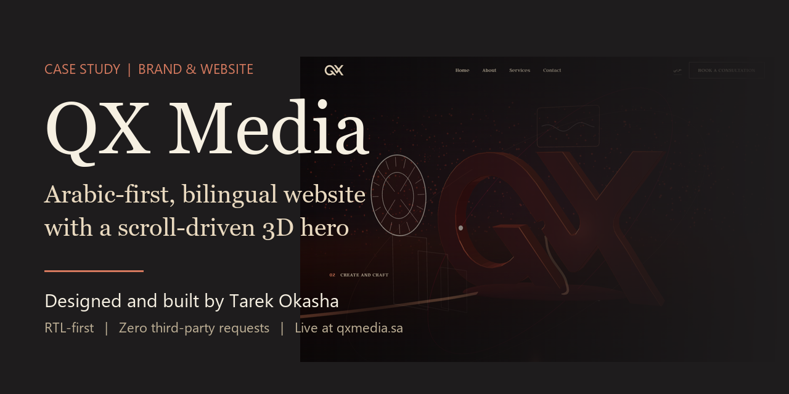
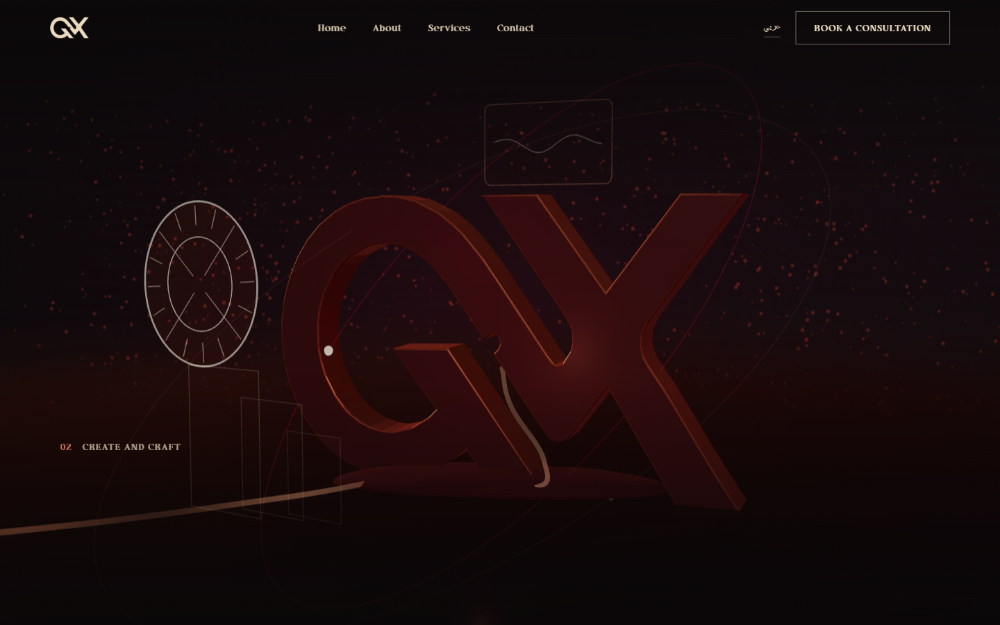
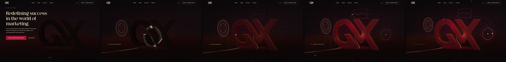
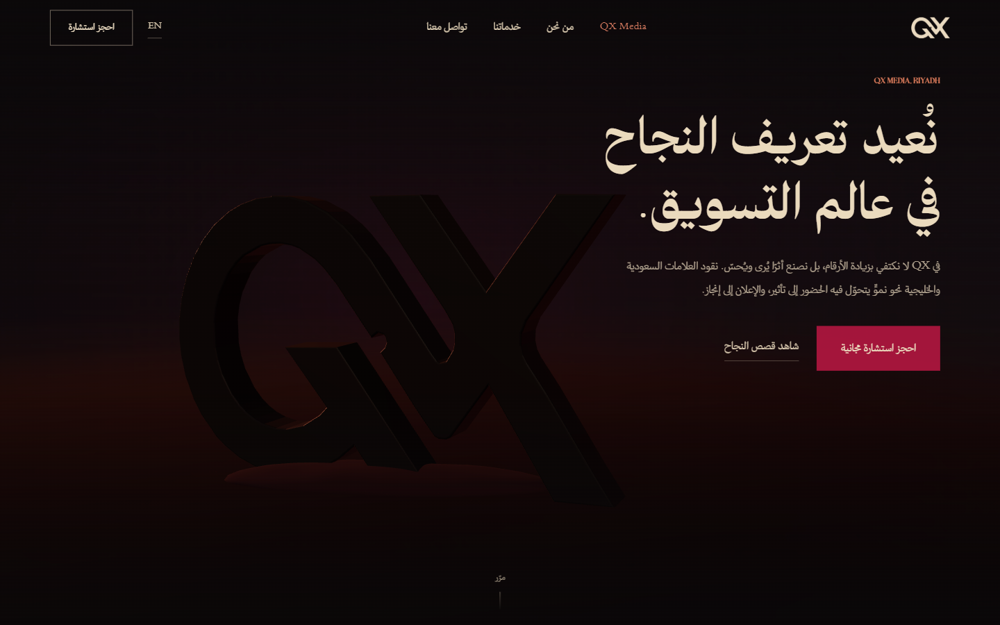
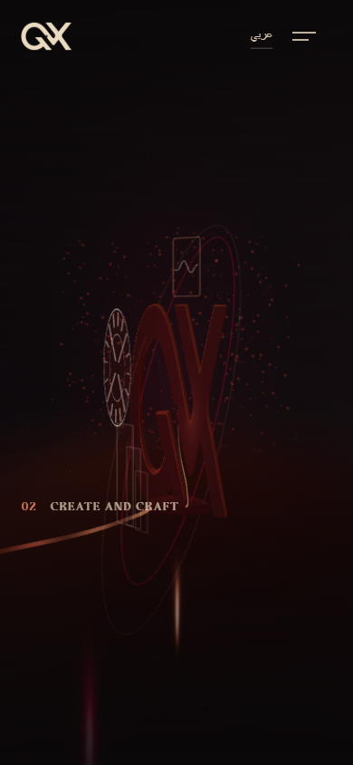
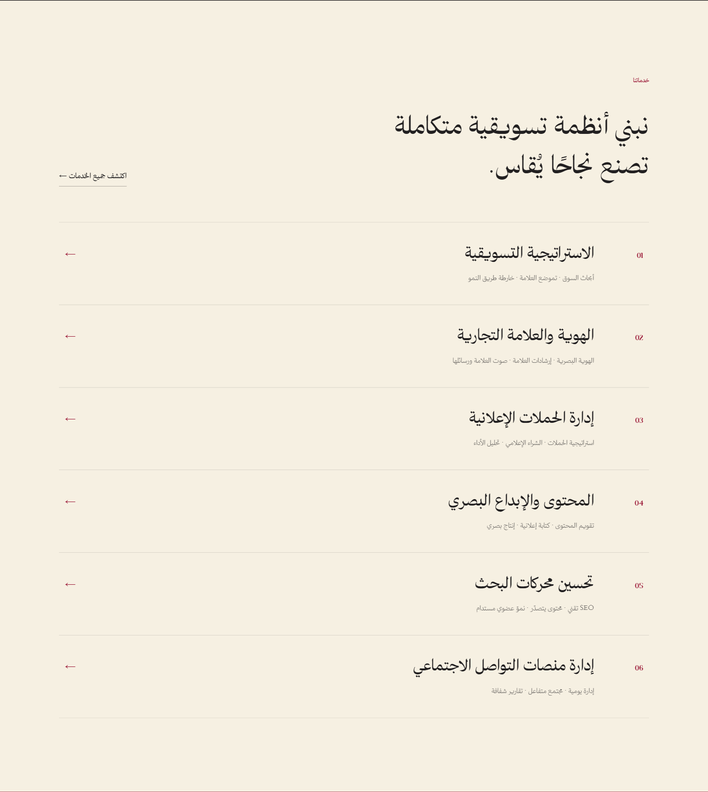
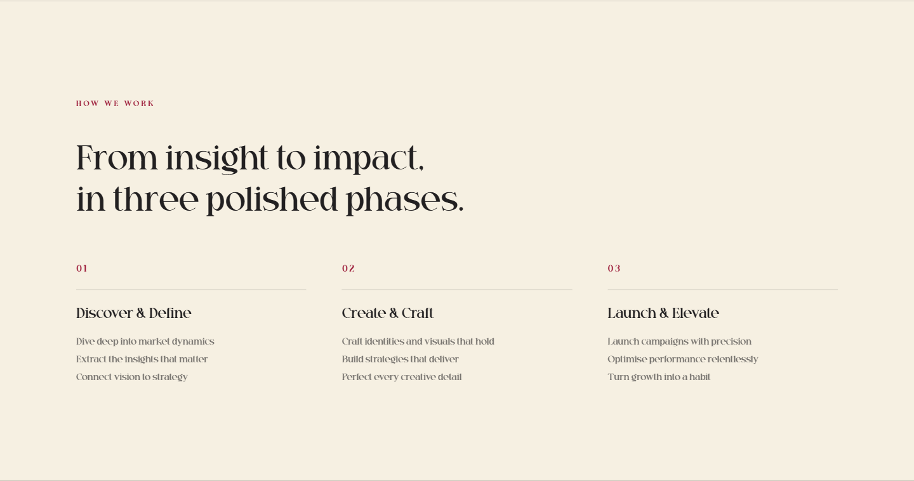

# QX Media

**An Arabic-first, bilingual WordPress theme with a scroll-driven 3D hero.** 
Designed and built by [Tarek Okasha](https://github.com/tarekokashha) for QX Media, a marketing house in Riyadh.

[**Live site**](https://qxmedia.sa) · [العربية](README.ar.md) · [Documentation](docs/) · [Portfolio](https://tarek-portfolio-phi.vercel.app)

---

The live site at [qxmedia.sa](https://qxmedia.sa), captured on 2 October 2026. The mark transforms as the visitor scrolls.

## The project

QX Media is a marketing house in Riyadh. I built its web presence: the **bilingual Arabic and English site on a custom WordPress theme**, the **brand system** behind it, and the **tone of voice** that runs through everything it publishes. It is an ongoing partnership, not a hand-off.

The brief was a site that looks like the brand sells, restrained and editorial, not a stock-agency template. It had to be Arabic first, with English alongside; fast; and not dependent on a page builder for the pages the design covers.

This repository is a case study of that work: how it is built, why it is built that way, and how it performs.

## At a glance

| | |
|---|---|
| **Role** | Brand system, design implementation, front-end and theme engineering, tooling: [Tarek Okasha](https://github.com/tarekokashha) |
| **Client** | QX Media, Riyadh, Saudi Arabia |
| **Live** | [qxmedia.sa](https://qxmedia.sa) |
| **Languages** | Arabic by default (right to left), English under `/en/`, through Polylang |
| **Stack** | WordPress 6.6+, PHP 8.0+, vanilla JavaScript, Three.js r169 (tree-shaken) |
| **The hero** | WebGL, five phases, 141 KB gzipped, loaded on the homepage only, after the `load` event |
| **Measured** | Mobile Lighthouse: accessibility **100**, SEO **100**, best practices 96. LCP 1.57 s, CLS 0. See [performance](docs/performance.md) |

## What is in it

### A 3D hero that is optional by construction
A pinned, scroll-driven WebGL scene transforms the brand mark through five phases. Every word a visitor needs is semantic HTML above the canvas, so with no WebGL, no JavaScript or a preference for reduced motion, the hero is a single readable screen. The headline is the largest contentful paint, never an image. The engine is bundled from a tree-shaken Three.js at **141 KB gzipped, down from 167 KB**, and it never reaches a visitor reading an article. → [3D hero](docs/3d-hero.md)

### Arabic engineered, not translated
Logical CSS properties everywhere, enforced by a gate that fails the build on a stray `margin-left`. Figures inside Arabic prose are bidi-isolated, so "−44%" keeps its sign on the correct side. One `dir` attribute, following the page language. No tracking on Arabic letters. → [Arabic and RTL](docs/rtl-and-arabic.md)

### Zero third-party requests from theme code
Fonts are self-hosted and the theme calls no CDN. That is not a promise: an automated check fails the build if any theme file references a third-party origin. → [Decisions](docs/decisions.md)

### A design system with rules that are checked
Square edges, no shadows, no `backdrop-filter`, a fixed palette. Each rule is something a later edit could quietly break, so each is enforced. → [Design system](docs/design-system.md)

### Pages by slug, content as data
The Arabic and English About, Services and Contact pages take over their layouts by slug, with an explicit template override, and every string on the site lives in one file. A checker proves every key a template reads exists in **both** languages. → [Architecture](docs/architecture.md)

### Tested
The theme is covered by automated checks: syntax across PHP 8.0 to 8.4, content-key parity in both languages, and a gate for right-to-left and performance rules.

## Screens

| Arabic, right to left | Mobile |
|---|---|
|  |  |
|  |  |

## About the source code

This repository documents the work. **The source code, the full site and its data are private and are not published here.** What is here is the design, the engineering decisions, the measurements and the screenshots.

## Documentation

| | |
|---|---|
| [Architecture](docs/architecture.md) | Request flow, language handling, assets, plugin interplay |
| [The 3D hero](docs/3d-hero.md) | Timeline, boot sequence, quality tiers, reduced motion, the bundle |
| [Arabic and RTL](docs/rtl-and-arabic.md) | Bidi numerals, logical properties, typography, the `dir` attribute |
| [Performance](docs/performance.md) | What was measured, how, and what it does not say |
| [Design system](docs/design-system.md) | Tokens, rules, components |
| [Decisions](docs/decisions.md) | The reasoning behind the non-obvious choices |

## License and credit

- **Documentation** is [CC BY 4.0](LICENSE). Reuse must credit **Tarek Okasha** and link to this repository.
- QX Media's name, logos, typefaces and copy are **not** licensed here. See [NOTICE](NOTICE.md).

Copyright (c) 2026 Tarek Okasha.

## About the author

I am **Tarek Okasha**, a robotics and automation engineer in Cairo who builds systems that run without supervision: six-axis robots, AI automations, and the custom software and brand presences that companies actually operate on. More of my work is in my [portfolio](https://tarek-portfolio-phi.vercel.app) and on [GitHub](https://github.com/tarekokashha).
