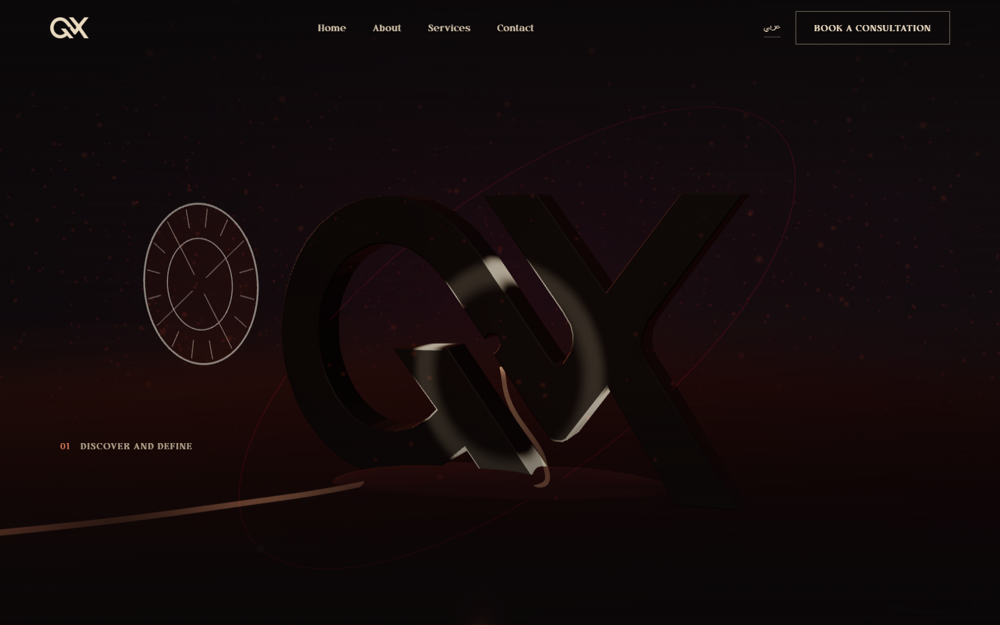
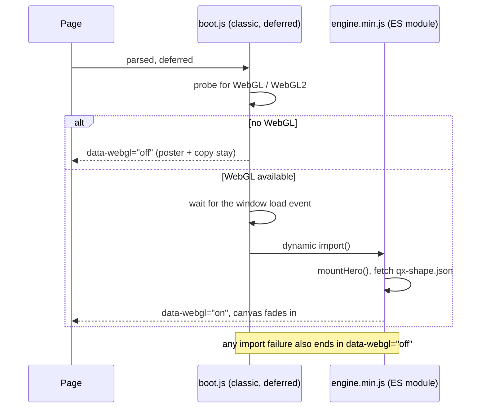

# The 3D hero

A pinned, scroll-driven WebGL scene that transforms the brand mark through five phases while the visitor scrolls. Designed and engineered by [Tarek Okasha](https://github.com/tarekokashha).

*The live site mid-transformation. Further frames: [p=0](img/live-hero-en-p00.png) · [p=0.48](img/live-hero-en-p48.png) · [p=0.68](img/live-hero-en-p68.png) · [p=0.76](img/live-hero-en-p76.png).*

## The principle: the scene is optional

Everything a visitor needs is **semantic HTML above the canvas, never inside WebGL**: the headline, the lead, both calls to action. The canvas is decorative and `aria-hidden`. That one rule decides the rest of the design:

- If WebGL is missing, if JavaScript never runs, or if the visitor prefers reduced motion, the hero is the CSS poster plus that HTML, at `100vh` instead of a pointless five-screen pin.
- The largest contentful paint is the `<h1>`, never an image or the canvas. Measured on the live site, the LCP element is `h1.qx-hero3d__h1`. See [performance.md](performance.md).

## How it boots

`boot.js` is a **classic script, not a module**, on purpose. The engine is a real ES module, but it is reached through `import()` so that it stays out of reach of LiteSpeed's JavaScript combine and minify pass. Combining an ES module into a concatenated bundle breaks its `import` statements, and that failure is silent until someone loads the homepage.

It also resolves the engine URL against the document, not against the script. A dynamic `import()` inside a classic script resolves relative specifiers against the script's own URL, which turned one path into `/qx-theme/assets/js/qx-theme/assets/js/hero/engine.js` during local preview. WordPress emits absolute URLs, which hid the bug on a real site; resolving explicitly keeps both honest.

The capability probe is cheap and runs before the library is fetched, and the load event is awaited so the hero never competes with the fonts and the LCP text.

## The scroll timeline

Scroll progress `p` runs from 0 to 1 across the pinned section. It is always normalised against `(pin height - 100vh)`, so changing the pin length re-times the whole sequence and nothing else needs touching.

| Progress | What happens |
|---|---|
| 0 | Intro copy visible: eyebrow, headline, lead, two calls to action. The mark is a dark, matte sculpture off to one side |
| 0.02 to 0.06 | The scroll cue fades out |
| 0.05 to 0.15 | The intro copy fades out |
| 0.04 to 0.20 | The sculpture travels from its offset to the centre of the stage |
| 0.08 to 0.62 | The ember core inside the mark intensifies |
| 0.13 to 0.66 | A glow band expands outward from the core across the surface |
| 0.17 to 0.37 | Stage label **01** is on screen |
| 0.34 to 0.62 | The mark takes shape: its material moves from charcoal to burgundy and terracotta, roughness falls, clearcoat rises |
| 0.38 to 0.57 | Stage label **02** |
| 0.58 to 0.78 | Stage label **03** |
| 0.30 to 0.85 | The core's colour moves from terracotta toward cream |
| 0.62 to 0.95 | The finish: the clearcoat settles |
| 0.80 to 0.93 | The metrics row fades in |

The three stage labels occupy the same position and cross-fade, each a word in the current language. The overlay elements are driven by `data-hero-in` and `data-hero-out` attributes in `template-parts/hero-3d.php`, so retiming a phase is a markup change.

The scene is composed of independent builders in `modules.js`: the extruded **mark**, a reflective **floor** with a cheap mirrored reflection, **dust** particles, a light **ribbon**, **signal** points, a **trajectory** curve, **orbits**, a **compass**, **grid planes**, a **content frame**, a **target ring** and **haze**. Each exposes `update( p, t )`, so the engine's frame function is one flat list.

## Quality tiers

The scene scales to the device it runs on:

| Tier | Viewport width | Pixel ratio cap | Signals | Dust | Trajectory points | Shadows |
|---|---|---|---|---|---|---|
| Desktop | 1180 px and up | 2 | 1100 | 420 | 700 | on |
| Tablet | 760 to 1179 px | 1.75 | 700 | 300 | 480 | on |
| Mobile | under 760 px | 1.5 | 420 | 170 | 260 | off |

## Staying cheap

- **Rendering pauses off screen.** An `IntersectionObserver` (with a 10% margin) stops the frame loop when the section is not visible, and the `visibilitychange` event stops it when the tab is hidden.
- Resize and orientation changes are debounced (140 ms).
- Progress is eased toward its target rather than snapped, with a gentle factor, so a fast flick of the wheel does not make the scene jump.
- A camera "breathing" motion of 1.5% adds life without ever shifting the mobile-safe crop.
- The pin is shorter on phones: `520vh` on desktop, `320vh` at 760 px and below. A full 520vh would add roughly 4,400 px to a 390 px wide page, and compact mobile is a standing requirement.

## Reduced motion

A visitor who prefers reduced motion gets **one static frame** and no pin. Two deliberate departures from the original prototype are worth recording:

1. The prototype called the overlay at `p = 1`. At that point the intro block is past its fade-out window, so the headline, lead and both buttons resolve to opacity 0 and the visitor is left with four numbers and no way in. The overlay is now left untouched, so every element sits at its CSS default: the copy visible, only the decorative stage labels hidden.
2. The prototype froze at `p = 0.92`. In the scrubbed version the copy has long faded out before the scene brightens, so the two never share the screen. In a still image they do, and at 0.92 the lit sculpture sits directly behind the lead paragraph. The static frame is therefore an early one, `p = 0.14`, with the sculpture matte and offset away from the copy column. Where "show the final state" and "keep text legible" disagree, **contrast wins**.

## The bundle

Three.js as a whole is 671 KB raw and 167 KB gzipped, most of which this scene never touches: no loaders, no controls, no post-processing, no animation system, no raycaster. A build step bundles the engine entry with esbuild and lets it tree-shake across the import graph, which keeps only the reachable code.

| | Raw | Gzipped |
|---|---|---|
| Three.js, complete | 671 KB | 167 KB |
| `engine.min.js` (engine, modules and the reachable part of Three r169) | 543 KB | 141 KB |

Bundling the entry, instead of hand-listing the symbols the scene uses, matters. A hand-written re-export file is one forgotten class away from a runtime crash that only shows up on the live homepage.

