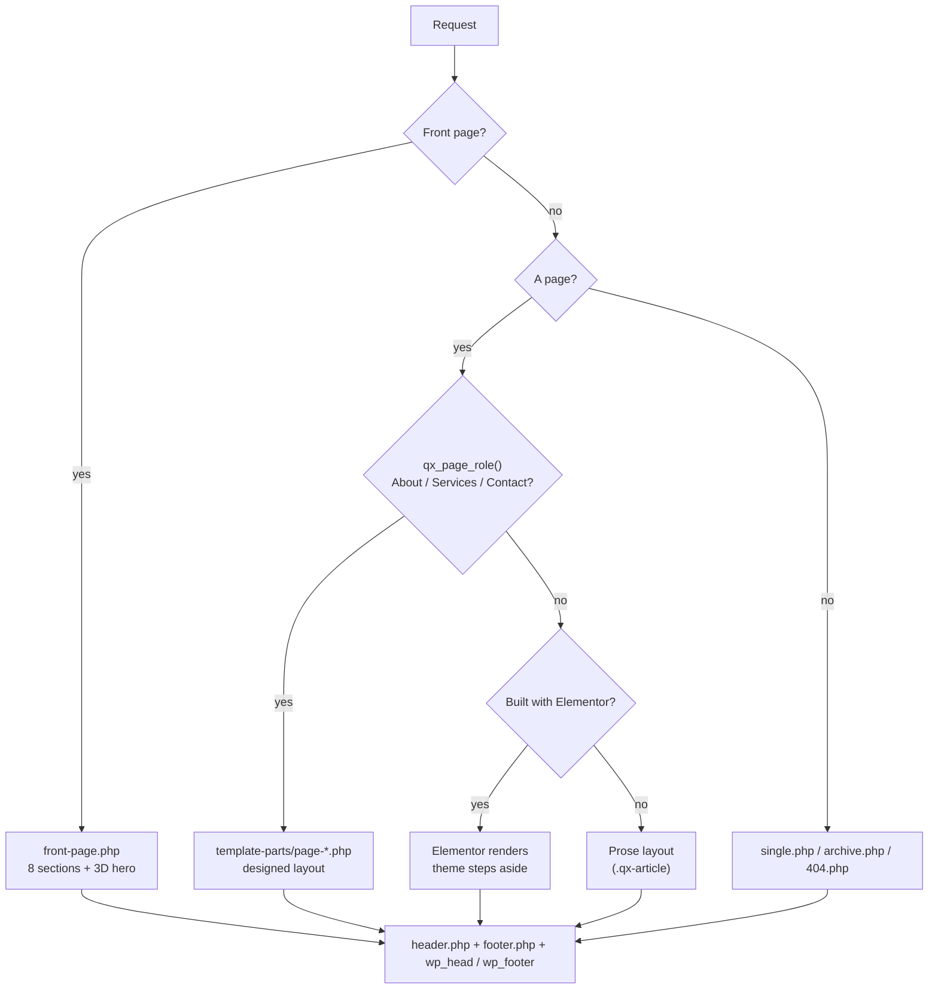

# Architecture

How the QX theme is put together, and why each piece is where it is. Written and built by [Tarek Okasha](https://github.com/tarekokashha).

The theme has one job: render an Arabic-first, bilingual marketing site that is fast, accessible in both reading directions, and does not depend on a page builder for the pages the design covers. Everything below serves that.

## Request flow

`page.php` documents the same three branches in its header comment. The important property is that **nothing is deleted**: when the theme takes over a page, the Elementor content is still in the database, so reverting a page is a matter of removing one branch.

## Language

Polylang serves Arabic as the default language and English under `/en/`, so the theme never assumes one direction.

- `qx_lang()` reads Polylang's current language and falls back to the WordPress locale. It reduces everything to `ar` or `en`.
- `qx_t( $ar, $en )` picks a string; `qx_is_ar()` is the boolean.
- The `language_attributes` filter forces `dir` to follow the **page** language, because Polylang can disagree with the locale on a given page. It also strips WordPress's own `dir` first, so the output never carries a duplicate attribute. See [rtl-and-arabic.md](rtl-and-arabic.md).
- `<body>` gets `qx-lang-ar` or `qx-lang-en`, plus `qx-rtl`, so CSS can branch on script without parsing the locale.

Polylang is optional. Without it the theme falls back to the locale and a plain language link.

## Template resolution by slug

The design covers three interior pages (About, Services, Contact) in two languages: six pages. Rather than ask anyone to open six pages in wp-admin and assign a template to each, `qx_page_role()` resolves the role in two steps:

1. **An explicitly assigned page template wins**, so the site owner can always override.
2. Otherwise the page **slug** is matched against `qx_page_map()`, which holds the Arabic and English slugs for each role. Slugs are percent-decoded first, because some installs store Arabic slugs encoded.

The existing URL structure is part of the contract and is not changed.

## Content as data

Every string on the homepage and the three interior pages lives in `inc/content.php`, in both languages, in one tree. Templates read from it and never hard-code copy. Two consequences:

- Editing text is editing one file, and the structure of the page stays untouched.
- A missing key renders as a silently empty heading in PHP 8, so an automated check builds the tree in Arabic and English, finds every key the templates read, and asserts each one resolves. It is the difference between "the file parses" and "the page renders".

The demo content that ships with the theme is neutral, and everything that would be a claim about a real business is marked as a placeholder. See [decisions.md](decisions.md).

## Asset pipeline

Load order is deliberate:

1. `fonts.css`, so the `@font-face` rules are parsed before anything references the families.
2. `style.css`: tokens, reset and base.
3. `components.css`: every component.
4. `qx.js`, deferred, in the footer.
5. **Front page only:** `hero.css` and `boot.js`. The 3D engine is reached by a dynamic `import()` after the `load` event, only once WebGL is confirmed. See [3d-hero.md](3d-hero.md).

WordPress's block library is loaded per block, not per request (`should_load_separate_core_block_assets`).

### What is removed

Each item below is a request or bytes that a marketing site does not use:

| Removed | Why |
|---|---|
| Emoji scripts and styles | Two files and a DNS lookup for a feature the brand does not use |
| oEmbed discovery, `wp-embed`, REST and shortlink `<link>` tags | Unused, and they expose endpoints |
| Generator tag, RSD and WLW links, adjacent-post links | Version disclosure and dead protocols |
| `classic-theme-styles` | Only exists to prop up pre-block themes |
| Dashicons for logged-out visitors | 45 KB, only needed in the admin bar |
| Global-styles SVG duotone filters | The theme declares no duotone presets, so it was always empty markup |
| XML-RPC | An attack surface with no use here |
| Comments and pings | The site has none and should not advertise any |
| Core and remote block patterns | Hundreds of irrelevant patterns in the inserter |

## Progressive enhancement

| Layer | Needs | If it is missing |
|---|---|---|
| Semantic HTML and CSS poster | Nothing | This **is** the hero: headline, lead, both calls to action |
| Scroll reveals | CSS `animation-timeline` or `IntersectionObserver` | Everything is shown rather than left invisible |
| Mobile menu, nav state | About 1.5 KB of JavaScript | The links remain reachable |
| 3D hero | WebGL and a successful `import()` | The section collapses to one screen with the poster and copy intact |

## Working with other plugins

| Plugin | How the theme cooperates |
|---|---|
| **Polylang** | Language detection; the theme's own header switcher is the only one (Polylang's injected menu items are filtered out so it does not appear twice) |
| **Elementor** | Pages built with it render their own markup untouched; the theme steps aside |
| **Rank Math / Yoast** | When either is active the theme does not emit its own `og:image`, so crawlers never see two |
| **LiteSpeed Cache** | The hero's scripts are excluded from JS combine and defer through filters inside the theme, so the exclusion travels with the code and not with a plugin setting |

## Structured data

On the front page the theme emits a `ProfessionalService` JSON-LD block, per language, so Arabic and English are each described in their own language. It reads the site title, the tagline and the contact constants, so there is nothing to keep in sync by hand.

