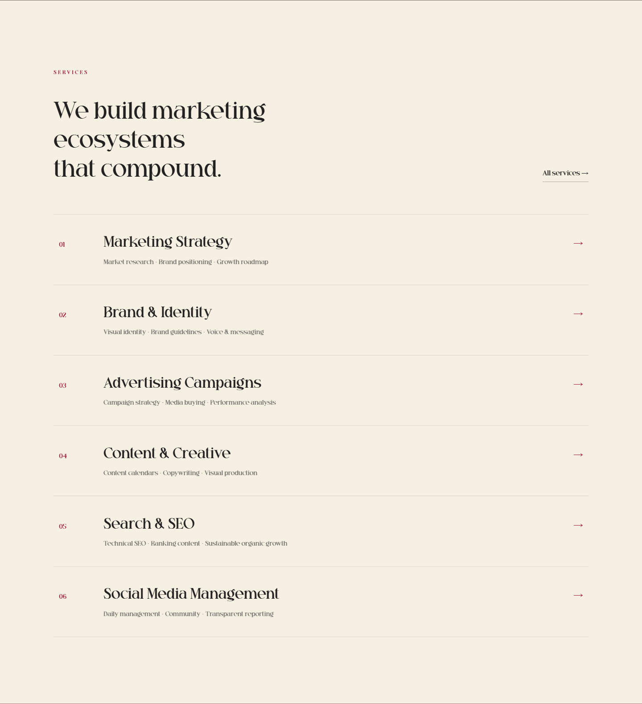
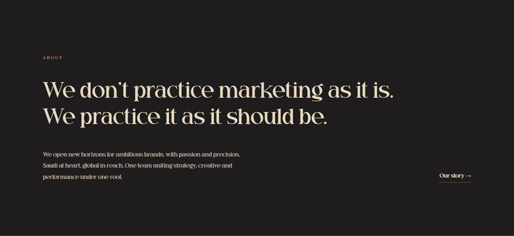

# Design system

The visual language of the QX Media website, implemented as CSS custom properties, `theme.json` tokens and a small set of components. Design implementation by [Tarek Okasha](https://github.com/tarekokashha), built to QX Media's design handoff.

| Light sections | Dark sections |
|---|---|
|  |  |

## The rules

The system is deliberately small. Each rule is something a future edit could quietly break, so most are enforced by a check rather than trusted to memory.

1. **Only the palette's colours are used anywhere.** The stylesheet states it plainly: it introduces no new colours. The 3D scene has its own namespaced set (below) and never leaks into the rest of the site.
2. **Radius is 0 everywhere.** Edges are square.
3. **No shadows. No `backdrop-filter`.** Depth comes from ground changes (cream to charcoal to burgundy) and hairlines. Both properties re-rasterise over the animating hero, so they are also a performance rule. `scripts/gate-rtl.mjs` fails the build on either.
4. **Logical properties only**, so Arabic mirrors itself. Also enforced. See [rtl-and-arabic.md](rtl-and-arabic.md).
5. **The Latin face ships one weight.** English hierarchy comes from size and letter-spacing, never from weight. Do not synthesise bold.
6. **No letter-spacing on Arabic.** Tracking breaks the cursive joins.

## Colour

| Token | Value | Role |
|---|---|---|
| `--qx-cream` | `#F6F0E2` | Page ground, light sections |
| `--qx-ink` | `#222021` | Primary text on light |
| `--qx-burgundy` | `#9C1B39` | Brand primary accent |
| `--qx-charcoal` | `#1E1C1D` | Dark section ground |
| `--qx-warm-cream` | `#EADAC0` | Text on dark and on burgundy |
| `--qx-terracotta` | `#D4795E` | Secondary accent on dark |
| `--qx-gold` | `#E2BD75` | Tertiary accent on dark: stats, quote marks |

Opacity variants of ink, warm cream and gold are the only permitted derivations. All seven colours are registered in `theme.json`, with the default WordPress palette, gradients and duotones switched off, so the block editor offers exactly these and nothing else.

### The 3D scene's colours

The hero uses six values of its own, scoped to `.qx-hero3d`: `--h-void #0A0809`, `--h-char #201D1F`, `--h-burg #7A1230`, `--h-crim #A7153C`, `--h-terra #D87959` and `--h-cream #F0DFC2`. They are namespaced so a scene-only colour can never be mistaken for a site token.

## Typography

| Token | Role |
|---|---|
| `--qx-latin` | Latin display and body serif. One weight. Falls back to a system serif |
| `--qx-arabic` | Arabic display and body serif, in five weights. Falls back to a system Arabic serif |

`theme.json` registers a nine-step type scale (`label`, `small`, `body`, `lead`, `h3`, `h2`, `h1`, `display`, `metric`) with fluid sizing, and turns off the default sizes and custom font sizes, so type in the editor is chosen from the scale instead of freehand.

**The brand typefaces are not distributed.** The theme degrades gracefully without them. See [install.md](install.md).

## Rhythm and layout

| Token | Value | Use |
|---|---|---|
| `--qx-pad-x` | `5vw` | Horizontal page padding |
| `--qx-max` | `1200px` | Content width |
| `--qx-max-narrow` | `1100px` | Narrow content width |
| `--qx-sec` | `150px` | Standard section padding (block axis) |
| `--qx-sec-sm` | `110px` | Compact section |
| `--qx-sec-lg` | `170px` | Generous section |

`theme.json` also sets the editor layout (`contentSize` 46rem, `wideSize` 88rem) and a spacing scale from 0.5 rem upward, with custom spacing sizes turned off.

## Motion

| Token | Value | Use |
|---|---|---|
| `--qx-ease` | `cubic-bezier(0.22, 1, 0.36, 1)` | Every transition and reveal |
| `--qx-reveal` | `0.95s` | Scroll reveals |
| `--qx-hover` | `0.45s` | Hover transitions |

Scroll reveals are CSS-first (`animation-timeline: view()`), with an `IntersectionObserver` fallback and a final fallback that shows everything rather than leave text invisible.

## Components

| Component | Notes |
|---|---|
| Navigation | Fixed, 80 px. Transparent over the hero, crossfading to solid cream after about 40 px of scroll; a dark state while the near-black hero fills the viewport |
| Mobile menu | A full-screen panel from a 44 by 44 hamburger below 920 px; closes on any link so it never covers the page it navigated to |
| Hero | The pinned 3D scene. See [3d-hero.md](3d-hero.md) |
| Numbered list rows | Services, with a narrow number column and text that wraps beneath it |
| Case cards | Metric, caption, two sub-metrics and a note; on narrower screens two across, with the third spanning the full width |
| Client wordmark strip | A row of names |
| Process | Three numbered steps |
| Testimonial and badges | Quote, attribution, partner badges |
| Final call to action | WhatsApp with page context, plus email |
| Footer | Mark and tagline, menu and contact in three columns, a hairline, the copyright line |
| Contact page | A form that opens WhatsApp with the answers pre-filled |
| Interior page hero | Shared by About, Services and Contact |
| Article prose | A 58ch reading measure with Naskh leading |
| Wordmark | The text fallback for the logo when no artwork is installed |

## Accessibility notes

- A skip link is the first focusable element on every page.
- The controls that have no visible text (the menu button, the close button) carry accessible names, and decorative elements (the canvas, the second logo copy, watermarks) are `aria-hidden`.
- The hero's stage labels are `aria-hidden` while invisible, and the overlay's pointer events are off until an element is opaque enough to use.
- Reduced motion gets a still hero with readable copy. See [3d-hero.md](3d-hero.md).
- Lighthouse results are in [performance.md](performance.md).
