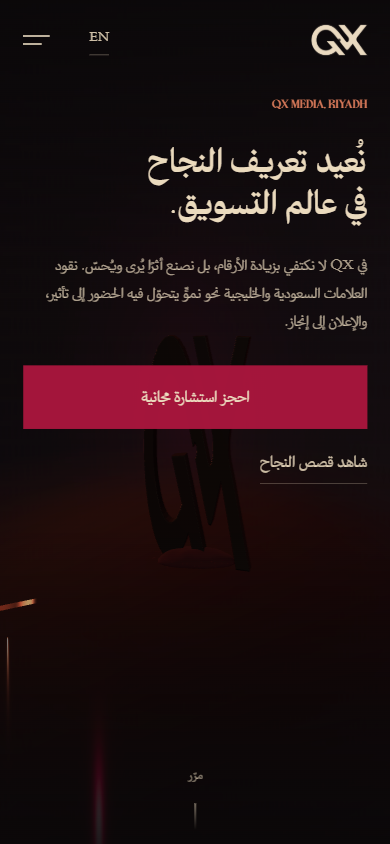

# Arabic and right-to-left engineering

The site is Arabic first, with English alongside. That is a different problem from "an English site with a translation", and most of the interesting bugs live in the gap. This page records how each one was solved. Engineering by [Tarek Okasha](https://github.com/tarekokashha).

| Arabic, desktop | Arabic, mobile |
|---|---|
|  |  |

## 1. Logical properties everywhere, and a gate to keep it that way

The strategy is **logical CSS properties, no second stylesheet**: `margin-inline-start`, `padding-inline-end`, `inset-inline-start`, `text-align: start`, and so on. The layout then mirrors itself with no rules written per direction.

That only holds if it is enforced. One stray `margin-left` is invisible in English and obviously wrong in Arabic, and it is exactly the kind of thing that creeps in during later edits. `scripts/gate-rtl.mjs` scans the stylesheets and fails the build on:

| Rule | Use instead |
|---|---|
| Physical `margin` / `padding` (`-left`, `-right`) | `margin-inline-start`, `padding-inline-end` |
| Physical `border-left` / `border-right` | `border-inline-start` / `border-inline-end` |
| `text-align: left` / `right` | `text-align: start` / `end` |
| Physical `left:` / `right:` offsets | `inset-inline-start` / `inset-inline-end` |
| `box-shadow` | Ground changes and hairlines carry depth |
| `backdrop-filter` | It re-rasterises every frame over the animating field; use an opaque surface |
| `ease-in-out` transitions | `var(--qx-ease)` |

Deliberate exceptions are allow-listed by exact substring, each with a written reason (a mirrored logo swash and a directional arrow must follow the reading direction; `transform-origin` takes physical keywords only, so each has an explicit `[dir='rtl']` rule beneath it). An allow-list without reasons is just a disabled test.

The `ease-in-out` rule was narrowed after it produced false positives on `var(--qx-ease)` and on two hover transitions the design specifies verbatim. A gate that cries wolf on correct code gets ignored, which is worse than not having one.

## 2. Numbers inside Arabic text

Figures inside Arabic prose reorder. Take "تكلفة طلب −44%": an Arabic phrase followed by a signed number. The minus sign is bidi-neutral, so in a right-to-left paragraph it resolves to the **paragraph direction** and lands on the wrong side of the digits. The same class of bug once produced "+120" where "120+" was meant.

`qx_ltr_nums()` fixes it at the point of output. It finds each numeric token (an optional sign, digits with an optional decimal part, an optional trailing unit) and wraps it in ``. HTML's user-agent stylesheet gives any element with a `dir` attribute `unicode-bidi: isolate`, so the sign, the digits and the unit stay together and in order, while the Arabic around them still reads right to left. **The copy itself is untouched.**

Two details came from real bugs:

- The regular expression allows **no whitespace inside a token**. Permitting it swallowed the space in "خلال 120 يومًا" into the isolated run, where it rendered on the wrong side and the words collided.
- The function returns escaped HTML, so callers use it with `wp_kses_post()` and must not escape again.

## 3. Which digits

The site uses **Western digits everywhere**: prices, phone numbers, metrics, dates and the section numerals. That is what Saudi brands actually use today, and mixing in Arabic-Indic digits (٠١٢٣٤٥٦٧٨٩) for one element would read as an inconsistency, not as a choice. An earlier iteration carried a helper for Arabic-Indic section numerals; the final design does not use it, so it was removed in 1.0.0 rather than left behind as dead code with a comment describing behaviour the site no longer has.

## 4. One `dir` attribute, and it follows the page

WordPress emits `dir` from the locale. Polylang can disagree with the locale on a per-page basis, so the `language_attributes` filter forces the attribute to follow the page language.

An earlier version appended its own `dir` and produced `<html dir="rtl" lang="ar" dir="rtl">`, a duplicate attribute. Browsers take the first and carry on, so it rendered fine and was invalid all the same. The cause was a pattern that required leading whitespace, while WordPress returns `dir="rtl" lang="ar"` with `dir` **first**, so it never matched. The pattern now uses `(^|\s)`.

## 5. Typography rules for Arabic

- **No letter-spacing on Arabic, ever.** Tracking breaks the cursive joins. The stylesheet resets `letter-spacing` to `0` for every text element under `[dir='rtl']`.
- Body text uses the lighter weight with looser leading (`line-height: 2`), which is what Naskh needs.
- Articles are set at a reading measure of **58ch**, which is most of what makes long Arabic text readable.
- The brand's Arabic face was converted to WOFF2 and subset to the Arabic range, with `unicode-range` splitting the families so an English page never downloads the Arabic font. The Arabic shaping tables (`GSUB`/`GPOS`: `init`, `medi`, `fina`, `liga`, `mark`, `mkmk`) were **kept** during subsetting. Dropping them is the classic way to break cursive joining and leave letters standing apart.
- Only one font file is preloaded per page, the face that sets the largest text above the fold for that script. Preloading more than one is how sites delay their own LCP.

The brand typefaces are not part of this repository. See [install.md](install.md) for where yours go.

## 6. The language switcher and the hero

- The switcher always appears in the language it switches **to**, set in that language's own typeface (**EN** on an Arabic page, **عربي** on an English one).
- Polylang injects its own switcher items into WordPress menus. The theme filters them out so there is exactly one switcher, in the designed position, without asking anyone to edit their menu.
- The 3D hero reads the document direction and mirrors its layout: the sculpture is offset to the opposite side so it never sits behind the copy column.

## 7. WhatsApp with context

The WhatsApp links carry a pre-filled message in the **visitor's language**, naming the page the enquiry came from, so the first message already says where it started. The contact form collects the answers and opens WhatsApp with them filled in.

## How it is tested

| Check | Covers |
|---|---|
| `php scripts/check-content-keys.php` | Every key the templates read exists in **both** languages, and Arabic and English do not leak into each other |
| `node scripts/gate-rtl.mjs` | No physical-direction CSS, no shadows, no `backdrop-filter` |
| Lighthouse on the live site | Accessibility, in both directions. See [performance.md](performance.md) |
